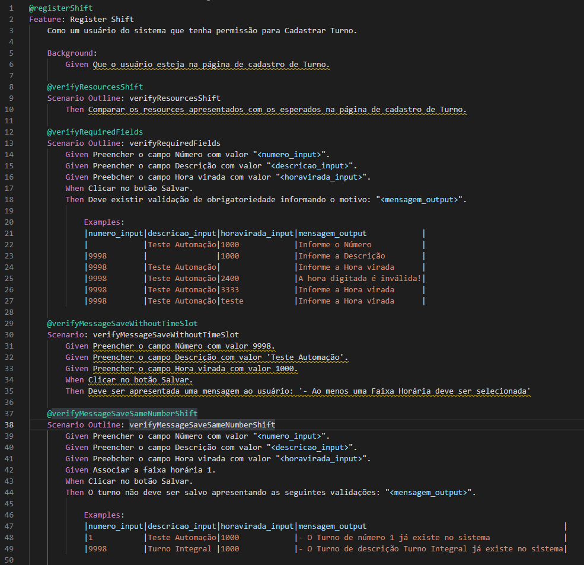

# Projeto Automação de Testes NewAccess

Este projeto realiza testes no sistema web NewAccess passando por diversos tipos de validações e cenários, utilizando linguagem Ruby juntamente com o framework Capybara e Cucumber. Em conjunto com esse objetivo, todo o projeto tem como precedente a metodologia ágil e o clean code.

## O que é Ruby, Capybara e Cucumber?

  ### Ruby:  
      
  * <a href="https://www.ruby-lang.org/pt/">Ruby</a> é uma linguagem interpretada e orientada a objetos com tipagem dinâmica e forte. Ou seja, ela é capaz de definir os tipos de uma variável ou uma função, de acordo com os valores que recebe.

     Além disso, conta com gerenciamento de memória automático, o que significa uma melhor otimização e performance da aplicação.

     Ruby é uma linguagem de script, open source e multiplataforma. Portanto, pode ser utilizada em diversos ambientes, como Windows, Linus, Unix, macOS, entre outros. 

  ### Capybara:
  * <a href="https://github.com/teamcapybara/capybara">Capybara</a> é um framework de automação de testes em aplicações web, open-source, e escrito em Ruby. Com ele é possível testar as aplicações simulando as ações que os usuários reais executariam.
   
    Ele abstrai a conexão entre o navegador e o código e realiza a simulação das ações dos usuário utilizando-se de frameworks que controlam navegadores e que simulam a execução dos mesmos em memória, tornando mais rápida a execução dos testes.
   
    Alguns exemplos de ações simuladas seriam: Acessar URLs, Preencher campos, Clicar, Verificar se valores foram apresentados na tela, etc.
      
  
 ### Cucumber:    
          
 * O <a href="https://cucumber.io/">Cucumber</a> é uma ferramenta que suporta Behavior Driven Development (BDD), visando integrar regras de negócios com linguagem de programação . Dessa forma, as necessidades reais do usuário são descritas focando o comportamento do software.
   
    Cucumber é usado para descrever o valor do negócio em uma linguagem natural, por isso permite que equipes de desenvolvimento de software descrevam como o software deve se comportar em texto simples, escrevendo especificações através de exemplos.
    
## Sobre o projeto:

O projeto de automação de teste tem o objetivo de realizar validações em todas as páginas web do sistema, testando todas suas funcionalidades, campos, botões, resources, mensagens e validando a regra de negócio.

Abaixo um diagrama de todas as telas do sistema e o andamento do projeto:

  

### As Features:

* As features do projeto são escritas separadas por tela e por ação que seja possível realizar como criação, alteração, cópia e exclusão. A escrita da feature é baseada no <a href="https://cucumber.io/docs/gherkin/">Gherkin</a> onde sua função é padronizar a forma de descrever especificações de cenários, baseado na regra de negócio.
  
  Exemplo de feature:
  

  

### A Codificação:

   xxxxxxxxx
    

## Estatísticas do Projeto

<a href="https://github.com/JuniorMonzani">      

